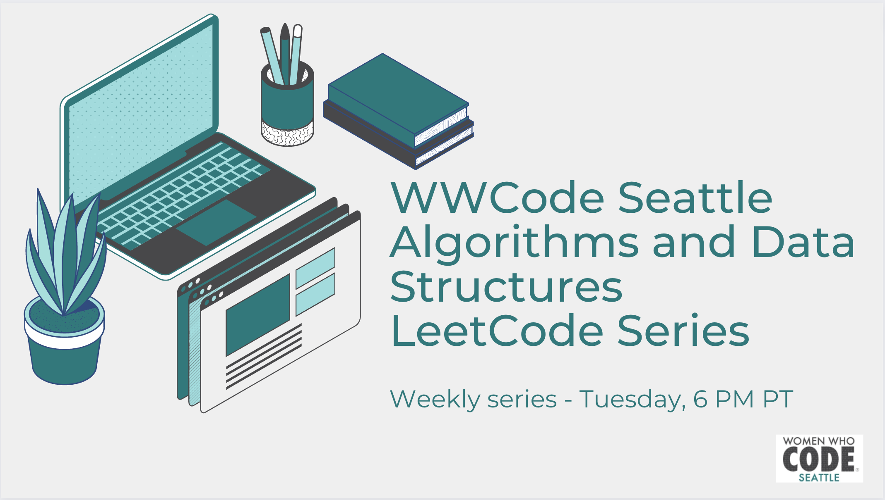

# Algorithms and Data Structures LeetCode Series

Welcome to the WWCode Algorithms and Data Structures LeetCode Series repo!! The purpose of this repo is to track various problems and solutions that will be part of this weekly series. You will have access to slides as well as helpful links to different resources. 

Use this repo as a learning platform to help prepare for technical interviews.

# Weekly Schedule

| **Topic/Concept**  |   **Date**        |           |
| ------------------ | ----------------- | --------- |
| Strings            | May 3, 2022       | Confirmed |
| Arrays             | May 10, 2022      | Tentative |
| Arrays             | May 17, 2022      | Tentative | 

# How to Contribute

 - Solve practice problems and contribute your solutions

 - Review code solutions

 - Volunteer and help create slides

# General Resources

- [www.leetcode.com](www.leetcode.com)

- [www.crackingthecodinginterview.com](https://www.crackingthecodinginterview.com/)

- [www.hackerrank.com/interview/interview-preparation-kit](https://www.hackerrank.com/interview/interview-preparation-kit)